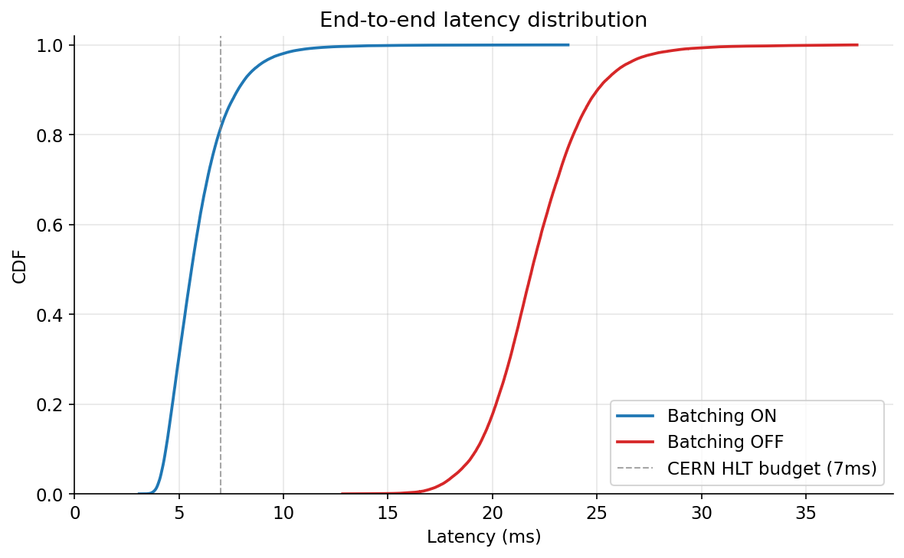
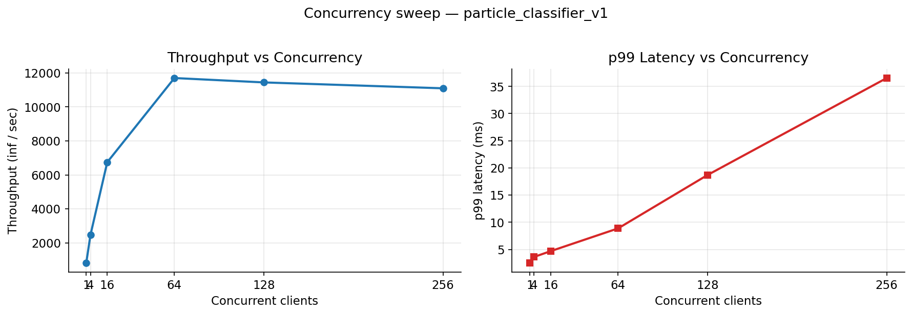

# Axon

A Python-based proof-of-concept of CERN's **SONIC** (Services for Optimized
Network Inference on Coprocessors) architecture — demonstrating coprocessor
offloading for real-time particle physics triggers using NVIDIA Triton Inference
Server, ONNX, and gRPC.

---

## Background

At the LHC, protons collide 40 million times per second. The High-Level Trigger
(HLT) must reduce this to ~1,000 events per second in real time, under a strict
**<7 ms latency budget per inference**. Modern ML triggers — CNNs, GNNs like
ParticleNet — are too slow on CPUs alone and too expensive to provision one GPU
per HLT node.

CMS's solution, published in [CMS-MLG-23-001], is **SONIC**: decouple inference
from the trigger CPUs entirely. CPU nodes send gRPC requests to a centralized
Triton GPU cluster. The GPU cluster uses **dynamic batching** to aggregate
requests from hundreds of concurrent clients, amortizing per-request overhead
and sustaining high throughput even with small individual batches.

This project replicated that architecture in a clean standalone PoC, using the
same production tools CMS deploys (Triton 25.12, ONNX, gRPC), against the UCI
HIGGS benchmark dataset (28 features, particle classification).

---

## Architecture

```
Training (offline)
──────────────────
HIGGS dataset (100K rows, 28 features)
  → StandardScaler → train/val split
  → MLP v1 (28→64→32→1) or v2 (28→128→128→64→1)
  → export to ONNX (opset 17, dynamic batch axis)


Inference (online)
──────────────────

  ┌─────────────────────────────────────────┐
  │  HLT simulation (benchmark client)      │
  │  asyncio workers × N concurrency        │
  │  each sends: one FP32[1×28] batch       │
  └────────────────┬────────────────────────┘
                   │  gRPC (port 8001)
                   ▼
  ┌─────────────────────────────────────────┐
  │  NVIDIA Triton Inference Server         │
  │  (Docker, --gpus all)                   │
  │                                         │
  │  Dynamic batching:                      │
  │    max_batch_size: 256                  │
  │    max_queue_delay: 100 µs              │
  │    preferred: [64, 128, 256]            │
  │                                         │
  │  model_repository/                      │
  │    particle_classifier_v1/1/model.onnx  │
  │    particle_classifier_v2/1/model.onnx  │
  └─────────────────────────────────────────┘
                   │
                   ▼
  ┌─────────────────────────────────────────┐
  │  Prometheus metrics (port 8002)         │
  │  GPU utilization, inference counts,     │
  │  queue durations                        │
  └─────────────────────────────────────────┘
```

---

## Setup

**Option 1 — Docker (no Python setup required):**

```bash
# Pull the benchmark client image
docker pull karandev7/axon-hlt:latest

# Run against any live Triton server
docker run --network host karandev7/axon-hlt \
  --url <triton-host>:8001 \
  --model particle_classifier_v1 \
  --concurrency 64 \
  --duration 30
```

**Option 2 — From source:**

**Prerequisites:** Docker with NVIDIA Container Toolkit, Python 3.10+.

```bash
git clone https://github.com/KaranSinghDev/AXON-HLT.git
cd AXON-HLT
make install       # create venv, install tritonclient + deps
make train         # download HIGGS subset, train, export ONNX (~2 min)
make serve         # docker compose up: Triton with dynamic batching
make benchmark     # run 30s gRPC load test at c=64
make plot          # generate plots → results/plots/
```

To run the A/B comparison (batching ON vs OFF):

```bash
# batching ON (already the default)
PYTHONPATH=src venv/bin/python3 scripts/benchmark.py \
  --concurrency 64 --duration 30 \
  --output results/benchmark_batching_on.json

# batching OFF
docker compose down
docker compose -f docker-compose.no-batching.yml up -d
PYTHONPATH=src venv/bin/python3 scripts/benchmark.py \
  --concurrency 64 --duration 30 \
  --output results/benchmark_batching_off.json

# generate plots
PYTHONPATH=src venv/bin/python3 scripts/plot_results.py \
  --batching-on  results/benchmark_batching_on.json \
  --batching-off results/benchmark_batching_off.json \
  --sweep        results/benchmark_sweep.json
```

---

## Results

All benchmarks ran on: RTX 3060 (12 GB), i7-12700H, 32 GB RAM, WSL2 (Ubuntu 22.04),
Triton 25.12-py3, tritonclient 2.64.0.

### Dynamic batching A/B — `particle_classifier_v1`, c=64

| Metric | Batching ON | Batching OFF |
|---|---|---|
| Throughput | **10,811 inf/sec** | 2,893 inf/sec |
| Latency p50 | **5.60 ms** | 21.89 ms |
| Latency p95 | 8.70 ms | 26.15 ms |
| Latency p99 | 10.91 ms | 29.01 ms |

Dynamic batching delivers **3.7× throughput** and **3.9× lower p50 latency**
at the same concurrency. Without batching, every client request becomes its own
GPU kernel launch, saturating the gRPC overhead; with batching, Triton coalesces
64+ requests into a single FP32[64×28] matrix multiply.

### Latency CDF with CERN HLT budget



The 7 ms HLT budget (dashed line) is met at the **~85th percentile** with
dynamic batching enabled at c=64. p50 (5.6 ms) is within budget. p99 (10.9 ms)
exceeds it — expected behavior at near-saturation concurrency; CERN's production
deployment runs with concurrency headroom to keep p99 in budget.

### Concurrency sweep — dynamic batching ON

| Concurrency | Throughput | p50 latency | p99 latency |
|---|---|---|---|
| 1 | 816 inf/sec | 1.07 ms | 2.52 ms |
| 4 | 2,462 inf/sec | 1.45 ms | 3.62 ms |
| 16 | 6,745 inf/sec | 2.18 ms | 4.70 ms |
| **64** | **11,701 inf/sec** | **5.25 ms** | **8.87 ms** |
| 128 | 11,444 inf/sec | 10.82 ms | 18.71 ms |
| 256 | 11,097 inf/sec | 22.48 ms | 36.54 ms |



Throughput saturates around c=64 — the server's GPU pipeline is fully utilized.
Beyond that, latency grows with queue depth while throughput holds flat, which
is the expected behavior from queueing theory (M/D/1 regime at high load).

The c=1 case (816 inf/sec, p99=2.52ms) is notably low: a single client never
fills a preferred batch size, so Triton waits the full 100µs queue delay on
every request. This validates the dynamic batching config — it's tuned for
concurrent workloads, not sequential ones.

### Model depth comparison — v1 vs v2 at c=64

| Model | Parameters | Throughput | p50 latency |
|---|---|---|---|
| v1 (28→64→32→1) | ~3K | 10,811 inf/sec | 5.60 ms |
| v2 (28→128→128→64→1) | ~28K | 10,743 inf/sec | 5.66 ms |

v2 (9× more parameters) shows no measurable throughput or latency difference.
This is explained in the profiling section below.

---

## Profiling Insights

GPU utilization stayed **below 1%** throughout all benchmarks. This is not a
configuration error — it reflects the compute profile of the workload:

- **Model size:** v1 has ~3K parameters. A single forward pass is ~6K
  FP32 multiply-adds. At 10K inf/sec with batch size 64, peak theoretical FLOP
  demand is ~4 GFLOPs/sec — about 0.04% of the RTX 3060's 12.7 TFLOPS.
- **Bottleneck:** the pipeline is I/O-bound on gRPC serialization and
  deserialization, not compute-bound on the GPU. This is why v1 and v2
  perform identically — neither saturates the GPU.
- **Production context:** CERN's SONIC deployment uses larger models
  (CNNs, GNNs like ParticleNet with ~500K–1M parameters) that are genuinely
  compute-intensive. The ~122K inf/sec reported in [CMS-MLG-23-001] reflects
  a multi-GPU server with C++ clients and larger batch sizes. This PoC
  replicates the architecture and the batching effect; not the production scale.

The I/O-bound result is actually useful: it shows that **Triton's gRPC layer
is the limiting factor** for small models, and that the dynamic batching
throughput gains (3.7×) come from reducing the number of kernel launches and
amortizing the fixed per-call overhead — exactly the mechanism SONIC describes.

---

## Repository layout

```
axon/
├── src/axon/
│   ├── model.py          # MLP v1 and v2
│   ├── data.py           # HIGGS downloader + preprocessing
│   ├── export.py         # ONNX export (dynamic batch axis)
│   ├── benchmark.py      # asyncio gRPC load generator
│   ├── client.py         # TritonClient with retry
│   ├── metrics.py        # Prometheus scraper (GPU util, queue depth)
│   └── plot.py           # matplotlib: sweep, A/B, CDF
├── scripts/
│   ├── train.py          # CLI: download → train → export ONNX
│   ├── benchmark.py      # CLI: run benchmark → save JSON
│   └── plot_results.py   # CLI: load JSON → generate plots
├── model_repository/                  # Triton config: dynamic batching ON
├── model_repository_no_batching/      # Triton config: batching OFF (A/B)
├── results/
│   ├── benchmark_batching_on.json
│   ├── benchmark_batching_off.json
│   ├── benchmark_sweep.json
│   ├── benchmark_v2_c64.json
│   └── plots/
├── docker-compose.yml
├── docker-compose.no-batching.yml
├── Makefile
└── tests/
```

---

## Tests

```bash
make test   # runs pytest (20 tests: data, model, ONNX export, schema)
```

---

## References

- [CMS-MLG-23-001] CMS Collaboration, *Portable Acceleration of CMS Production Workflow with Coprocessors as a Service*, Feb 2024. https://arxiv.org/abs/2402.15366
- [SONIC] Rankin et al., *Accelerating Machine Learning Inference with GPUs in High Energy Physics*, Computing and Software for Big Science, 2021.
- [NVIDIA Triton Inference Server](https://github.com/triton-inference-server/server)
- [UCI HIGGS Dataset](https://archive.ics.uci.edu/ml/datasets/HIGGS) — Baldi et al., 2014.

---

## License

Apache 2.0 — see [LICENSE](LICENSE).
